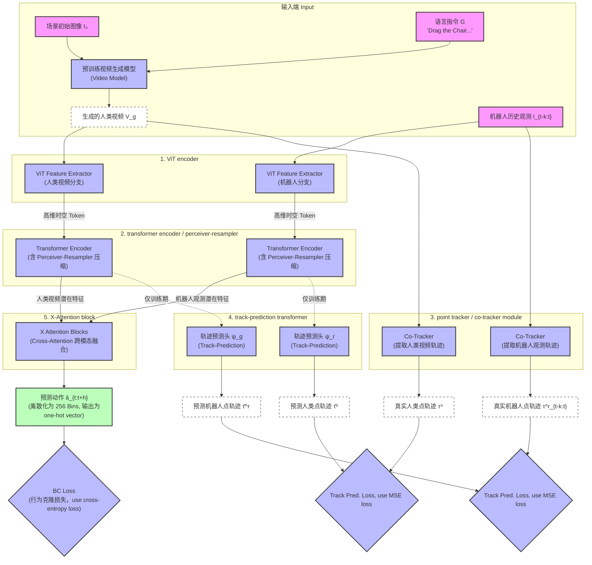

# Gen2Act Codebase Structure

This repository is small, so the implementation is split into a light package
instead of a large framework.

## Chosen Backbone

- Vision encoder: `ViT-B/16`-style backbone implemented with PyTorch modules
- Transformer stack: `torch.nn.TransformerEncoder` and `TransformerEncoderLayer`

Why this choice:

- It matches a widely used ViT configuration from the Torchvision ecosystem.
- It keeps the implementation dependency-light and easy to inspect.
- The encoder stack is standard PyTorch, so training, debugging, and export are straightforward.

References:

- Torchvision `vit_b_16`: https://docs.pytorch.org/vision/main/models/generated/torchvision.models.vit_b_16.html
- PyTorch `TransformerEncoderLayer`: https://docs.pytorch.org/docs/main/generated/torch.nn.modules.transformer.TransformerEncoderLayer.html

## Directory Layout

```text
architecture.py
gen2act/
  __init__.py
  data/
    __init__.py
    hdf5_policy_dataset.py
  modeling/
    __init__.py
    vit.py
    resampler.py
    transformer.py
    track.py
    policy.py
configs/
  gen2act_policy.toml
scripts/
  train_policy.py
  infer_policy.py
```

## Module Responsibilities

- `gen2act/modeling/vit.py`
  - Patch embedding
  - ViT-B/16-style positional encoding
  - Transformer encoder blocks
  - Outputs patch tokens `[B, P, D]`

- `gen2act/modeling/resampler.py`
  - Perceiver-style compression
  - Converts variable-length frame tokens into fixed latent tokens `[B, K, D]`

- `gen2act/modeling/transformer.py`
  - Generic `TransformerEncoder` wrapper for fusion and other sequence processing

- `gen2act/modeling/track.py`
  - Training-only auxiliary trajectory predictor
  - Takes conditioning tokens plus point tracks and predicts future coordinates

- `gen2act/modeling/policy.py`
  - Composes the full policy
  - Encodes human video and robot history
  - Fuses both streams
  - Predicts discretized actions, terminate, and gripper logits
  - Exposes `build_default_policy()`

- `architecture.py`
  - Compatibility wrapper that re-exports the main classes for older imports

## Runtime Entry Points

- `configs/gen2act_policy.toml`
  - Central model, data, train, and inference defaults
- `scripts/train_policy.py`
  - HDF5-based behavior cloning training loop for the Gen2Act policy
- `scripts/infer_policy.py`
  - Loads a checkpoint and runs one-step policy inference on a demo window
- `gen2act/data/hdf5_policy_dataset.py`
  - Dataset adapter that turns Isaac Lab HDF5 demos into policy training windows

## Data Flow

1. A generated human video is encoded frame-by-frame by the ViT backbone.
2. A separate robot history clip is encoded with the same ViT.
3. Each token sequence is compressed by its own Perceiver resampler.
4. The compressed tokens are concatenated and processed by a transformer encoder.
5. The pooled context is mapped to:
   - action logits per dimension
   - terminate logits
   - gripper logits
6. During training, the auxiliary track predictor consumes the same latent tokens and predicts point trajectories.

## Tensor Shapes

- Human video input: `[B, 16/24, 3, 224, 224]`
- Robot history input: `[B, 8, 3, 224, 224]`
- ViT output per frame: `[B*T, P, D]`
- Resampler output: `[B, K, D]`
- Fused token sequence: `[B, K_h + K_r, D]`
- Pooled context: `[B, D]`
- Action logits: `[B, A, 256]`
- Terminate logits: `[B, 2]`
- Gripper logits: `[B, 2]`

## Notes

- The code is written to be easy to swap into a more complete robotics training loop.
- The video generator is intentionally not part of this package; it is treated as an external, frozen dependency.
- The auxiliary track predictor is optional at inference time.

### architecture graph:

